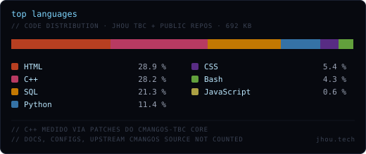

<p align="center">
  
</p>

<p align="center">
  <a href="https://jhou.tech"></a>
  &nbsp;
  <a href="https://www.linkedin.com/in/jhonatanviana/"></a>
  &nbsp;
  <a href="mailto:jhou@jhou.tech"></a>
  &nbsp;
  <a href="https://www.instagram.com/jhonatan_viana/"></a>
</p>

<br/>

<table>
<tr><td>

```bash
$ ls -la ~/

drwxr-xr-x   sobre/         # quem é
drwxr-xr-x   laboratorio/   # o que construí
drwxr-xr-x   stack/         # ferramentas
-rw-r--r--   now.log        # no que estou agora
```

</td></tr>
</table>

<br/>

<h3 id="sobre">&nbsp;<code>~/sobre</code></h3>

Especialista em Soluções de TI na **Pense Rede** (Cariacica, ES). Trabalho no ponto em que infraestrutura encontra produto — desde a operação que sustenta o sistema até a decisão técnica que define o roadmap.

Meu jeito de aprender é construindo: monto, quebro, reconstruo, documento. Cada projeto vira um laboratório.

<br/>

<h3 id="laboratorio">&nbsp;<code>~/laboratorio</code></h3>

<table>
  <tr>
    <td width="220" valign="top">
      <h3>&nbsp;🟢 &nbsp;Jhou TBC</h3>
      <sub>&nbsp;<a href="https://play.jhou.tech">play.jhou.tech</a></sub>
      <br/><br/>
      <sub>&nbsp;<b>LIVE SINCE</b><br/>&nbsp;May 2026</sub>
      <br/><br/>
      <sub>&nbsp;<b>OPERAÇÃO</b><br/>&nbsp;Solo · bare-metal</sub>
      <br/><br/>
      <sub>&nbsp;<b>STATUS</b><br/>&nbsp;Produção pública</sub>
    </td>
    <td valign="top">
      <p>
        Servidor privado de <b>WoW The Burning Crusade 2.4.3</b> em produção pública.
        Realm completo construído e mantido sozinho — do core em C++ ao painel web,
        passando por DB, observabilidade e exposição segura.
      </p>
      <p>
        <b>Stack &nbsp;·&nbsp;</b>
        <code>Ubuntu&nbsp;24.04</code> &nbsp;
        <code>cMaNGOS-TBC (C++)</code> &nbsp;
        <code>MariaDB</code> &nbsp;
        <code>Flask&nbsp;+&nbsp;gunicorn</code> &nbsp;
        <code>nginx</code> &nbsp;
        <code>Cloudflare&nbsp;Tunnel</code> &nbsp;
        <code>netdata</code>
      </p>
      <p>
        <b>Engenharia &nbsp;·&nbsp;</b>
        patches custom no core &nbsp;·&nbsp;
        SQL versionado &nbsp;·&nbsp;
        backups off-site automatizados &nbsp;·&nbsp;
        hardening anti-DDoS (UFW&nbsp;+&nbsp;sysctl) &nbsp;·&nbsp;
        runbook próprio &nbsp;·&nbsp;
        changelog bilíngue (PT/EN)
      </p>
      <p>
        <sub><i>Single-server private WoW TBC realm — live since May 2026. Solo ops: bare-metal Linux, C++ core, custom patches, hardened public exposure.</i></sub>
      </p>
    </td>
  </tr>
</table>

<details>
  <summary>&nbsp;<sub><b>📐 &nbsp; SERVICE MAP COMPLETO &nbsp; ·  &nbsp; abrir</b></sub></summary>
  <br/>
  <table>
    <thead>
      <tr>
        <th align="left"><sub>CAMADA</sub></th>
        <th align="left"><sub>COMPONENTE</sub></th>
        <th align="left"><sub>FUNÇÃO</sub></th>
      </tr>
    </thead>
    <tbody>
      <tr><td><sub><b>EDGE</b></sub></td><td><code>Cloudflare&nbsp;Tunnel</code></td><td><sub>publicação HTTPS sem porta exposta</sub></td></tr>
      <tr><td><sub><b>EDGE</b></sub></td><td><code>nginx</code></td><td><sub>roteamento play / jhou / monitor</sub></td></tr>
      <tr><td><sub><b>APP</b></sub></td><td><code>Flask&nbsp;+&nbsp;gunicorn (1w/8t)</code></td><td><sub>painel do jogador, registro double-opt-in, votos, LGPD</sub></td></tr>
      <tr><td><sub><b>APP</b></sub></td><td><code>cMaNGOS-TBC&nbsp;(C++)</code></td><td><sub>core do jogo · patch consolidado próprio</sub></td></tr>
      <tr><td><sub><b>DADOS</b></sub></td><td><code>MariaDB&nbsp;10.11</code></td><td><sub>realmd · characters · mangos · logs</sub></td></tr>
      <tr><td><sub><b>OBS</b></sub></td><td><code>netdata</code></td><td><sub>cpu / mem / disco / rede em tempo real</sub></td></tr>
      <tr><td><sub><b>SEC</b></sub></td><td><code>UFW&nbsp;+&nbsp;sysctl&nbsp;+&nbsp;fail2ban</code></td><td><sub>connlimit · SYN flood guard · brute-force</sub></td></tr>
      <tr><td><sub><b>BACKUP</b></sub></td><td><code>backup-db.sh&nbsp;+&nbsp;repo privado</code></td><td><sub>dump diário rotativo · off-site automático</sub></td></tr>
      <tr><td><sub><b>BOOT</b></sub></td><td><code>systemd&nbsp;+&nbsp;tmux&nbsp;+&nbsp;screen</code></td><td><sub>serviços managed · jogo em screen dentro do tmux</sub></td></tr>
      <tr><td><sub><b>DEPLOY</b></sub></td><td><code>git&nbsp;+&nbsp;Makefiles&nbsp;+&nbsp;scripts</code></td><td><sub>SQL numerada · patches versionados · runbook próprio</sub></td></tr>
    </tbody>
  </table>
  <p><sub>&nbsp;Tudo opera em bare-metal num único notebook Dell (Intel i5-4200U · 7.7 GB RAM · Ubuntu 24.04 LTS).</sub></p>
</details>

<br/>

<h3 id="stack">&nbsp;<code>~/stack</code></h3>

<table>
  <tr>
    <td align="right" valign="middle" width="170"><sub><b>OPERAÇÃO &amp; INFRA</b></sub></td>
    <td>
      
      
      
      
      
      
      
      
      
    </td>
  </tr>
  <tr>
    <td align="right" valign="middle"><sub><b>BACKEND &amp; DADOS</b></sub></td>
    <td>
      
      
      
      
      
      
    </td>
  </tr>
  <tr>
    <td align="right" valign="middle"><sub><b>WEB</b></sub></td>
    <td>
      
      
      
    </td>
  </tr>
  <tr>
    <td align="right" valign="middle"><sub><b>WORKFLOW</b></sub></td>
    <td>
      
      
      
      
    </td>
  </tr>
</table>

<p align="center">
  
</p>

<br/>

<h3 id="now">&nbsp;<code>~/now</code></h3>

<table>
<tr><td>

```log
$ tail -1 ~/now.log
[2026-05-29]  refatorando JS inline dos templates do painel para arquivos externos
              e removendo 'unsafe-inline' do script-src no CSP. próximo na fila:
              CSRF per-user (destrava multi-worker no gunicorn).
```

</td></tr>
</table>

<br/>

<p align="center">
  <sub><code>~$ uptime &nbsp;—&nbsp; sistemas em pé desde que aprendi a derrubá-los com cuidado.</code></sub>
</p>

<p align="center">
  <sub><code>// jhou.tech &nbsp;·&nbsp; cariacica → internet &nbsp;·&nbsp; v.2026.05</code></sub>
</p>
