  

  &nbsp;
  &nbsp;
  &nbsp;
  &nbsp;
  

 

## &nbsp;`~/sobre`

Especialista em Soluções de TI na **Pense Rede** (Cariacica, ES). Trabalho no ponto em que infraestrutura encontra produto — desde a operação que sustenta o sistema até a decisão técnica que define o roadmap.

Meu jeito de aprender é construindo: monto, quebro, reconstruo, documento. Cada projeto vira um laboratório.

 

## &nbsp;`~/laboratorio`

<table>
  <tr>
    <td width="200" valign="top">
      <h3>🟢 Jhou TBC</h3>
      <a href="https://play.jhou.tech">play.jhou.tech</a>
        
      <b>live since</b> May 2026
        
      <b>operação</b> solo · bare-metal
    </td>
    <td valign="top">
      

        Servidor privado de <b>WoW The Burning Crusade 2.4.3</b> em produção pública.
        Realm completo construído e mantido sozinho — do core em C++ ao painel web,
        passando por DB, observabilidade e exposição segura.
      

      

        <b>Stack &nbsp;·&nbsp;</b>
        <code>Ubuntu&nbsp;24.04</code> &nbsp;
        <code>cMaNGOS-TBC (C++)</code> &nbsp;
        <code>MariaDB</code> &nbsp;
        <code>Flask&nbsp;+&nbsp;gunicorn</code> &nbsp;
        <code>nginx</code> &nbsp;
        <code>Cloudflare&nbsp;Tunnel</code> &nbsp;
        <code>netdata</code>
      

      

        <b>Engenharia &nbsp;·&nbsp;</b>
        patches custom no core &nbsp;·&nbsp;
        SQL versionado &nbsp;·&nbsp;
        backups off-site automatizados &nbsp;·&nbsp;
        hardening anti-DDoS (UFW + sysctl) &nbsp;·&nbsp;
        runbook próprio &nbsp;·&nbsp;
        registro bilíngue de mudanças (PT/EN)
      

      

        <i>Single-server private WoW TBC realm — live since May 2026. Solo ops: bare-metal Linux, C++ core, custom patches, hardened public exposure.</i>
      

    </td>
  </tr>
</table>

 

## &nbsp;`~/stack`

<table>
  <tr>
    <td align="right" valign="top"><b>OPERAÇÃO &amp; INFRA</b></td>
    <td>
      
      
      
      
      
      
      
      
      
    </td>
  </tr>
  <tr>
    <td align="right" valign="top"><b>BACKEND &amp; DADOS</b></td>
    <td>
      
      
      
      
      
      
    </td>
  </tr>
  <tr>
    <td align="right" valign="top"><b>WEB</b></td>
    <td>
      
      
      
    </td>
  </tr>
  <tr>
    <td align="right" valign="top"><b>WORKFLOW</b></td>
    <td>
      
      
      
      
    </td>
  </tr>
</table>

 

  <code>~$ uptime &nbsp;—&nbsp; sistemas em pé desde que aprendi a derrubá-los com cuidado.</code>

